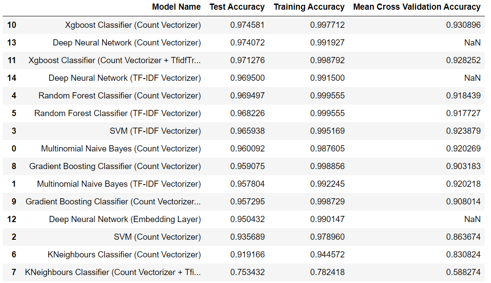
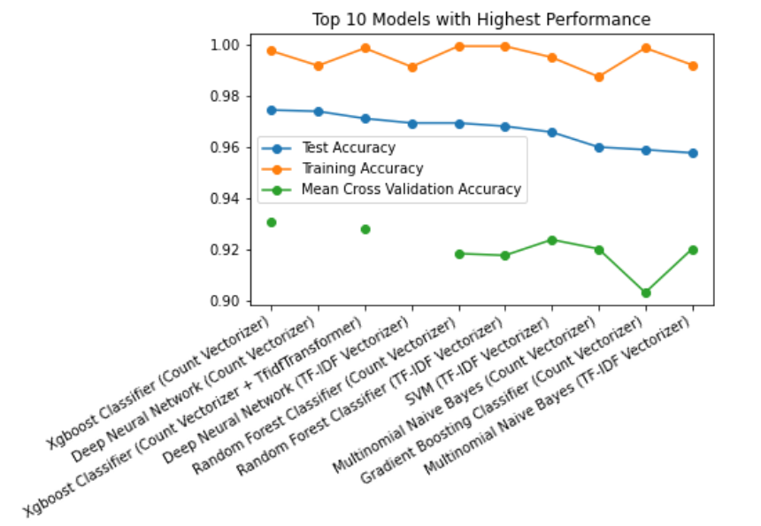

# NLP-Category-Predictions-Task
     

## Repository Structure
* <strong>Report.pdf</strong> - File containing detailed analysis & results of the task 
* <strong>Exploratory-Data-Analysis.ipynb</strong> - File containting <strong>data analysis and preprocessing & results (Main File)</strong>
* <strong>ML-Models-Implementation.ipynb</strong> - File containing <strong>implementation of ML models</strong>
* <strong>Deep-Learning-Approach.ipynb</strong> - File containing the use of <strong>deep neural networks</strong> for predictions
* <strong>dataset/</strong> - Original Dataset
* <strong>clean-dataset/</strong> - Data after Cleaning and Preprocessing
* <strong>trained-models/</strong> - Pickle File/Directory of trained models

## Reproducing the Development Environment
* Clone this repository.
* Set up a python virtual environment and activate it in your terminal. (Refer - <a>https://docs.python.org/3/tutorial/venv.html</a>)
* Open it in terminal and run the following command - 
~~~ 
        pip install -r requirements.txt
~~~

## Results Acheived (Decreasing order of Test Accuracy)

## Top 10 models with Highest Test Accuracy

## Citations
* https://www.analyticsvidhya.com/blog/2014/11/text-data-cleaning-steps-python/
* https://www.analyticsvidhya.com/blog/2016/08/beginners-guide-to-topic-modeling-in-python/
* https://www.analyticsvidhya.com/blog/2017/01/ultimate-guide-to-understand-implement-natural-language-processing-codes-in-python/
* https://pub.towardsai.net/natural-language-processing-nlp-with-python-tutorial-for-beginners-1f54e610a1a0
* https://www.machinelearningplus.com/nlp/natural-language-processing-guide/
* https://towardsdatascience.com/ml-powered-product-categorization-for-smart-shopping-options-8f10d78e3294
* https://www.analyticsvidhya.com/blog/2017/01/ultimate-guide-to-understand-implement-natural-language-processing-codes-in-python/
* https://medium.com/text-classification-algorithms/text-classification-algorithms-asurvey-a215b7ab7e2d
* https://neptune.ai/blog/text-classification-tips-and-tricks-kaggle-competitions
* https://neptune.ai/blog/exploratory-data-analysis-natural-language-processing-tools
* https://machinelearningmastery.com/xgboost-for-imbalanced-classification/#:~:text=The%20XGBoost%20algorithm%20is%20effective,over%20the%20model%20training%20procedure.
* https://medium.datadriveninvestor.com/deep-learning-techniques-for-text-classification-9392ca9492c7
