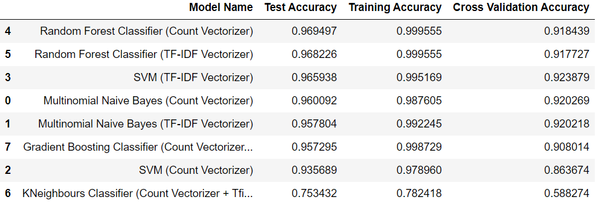

# MIDAS-Category-Predictions-Task-NLP

## Repository Structure
* <strong>Exploratory-Data-Analysis.ipynb</strong> - File containting <strong>data analysis and preprocessing</strong>
* <strong>ML-Models-Implementation.ipynb</strong> - File containing <strong>implementation of ML models</strong>
* <strong>Deep-Learning-Approach</strong> - File containing the use of <strong>deep neural networks</strong> for predictions

## Reproducing the Development Environment
* Clone this repository.
* Set up a python virtual environment and activate it in your terminal. (Refer - <a>https://docs.python.org/3/tutorial/venv.html</a>)
* Open it in terminal and run the following command - 
~~~ 
        pip install -r requirements.txt
~~~

## Results Acheived 

## Citations
* https://thinkinfi.com/complete-guide-for-natural-language-processing-in-python/
* https://towardsdatascience.com/ml-powered-product-categorization-for-smart-shopping-options-8f10d78e3294
* https://neptune.ai/blog/text-classification-tips-and-tricks-kaggle-competitions
* https://towardsdatascience.com/model-selection-in-text-classification-ac13eedf6146
* https://machinelearningmastery.com/xgboost-for-imbalanced-classification/#:~:text=The%20XGBoost%20algorithm%20is%20effective,over%20the%20model%20training%20procedure.
